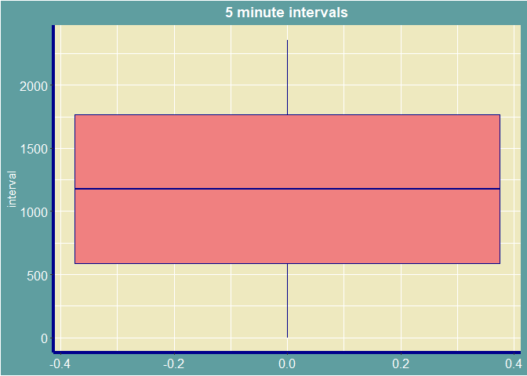
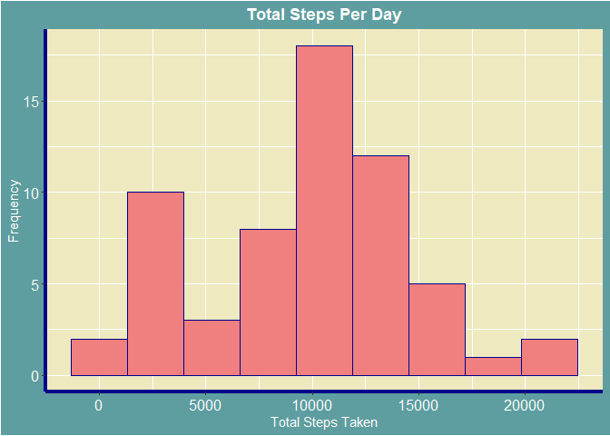
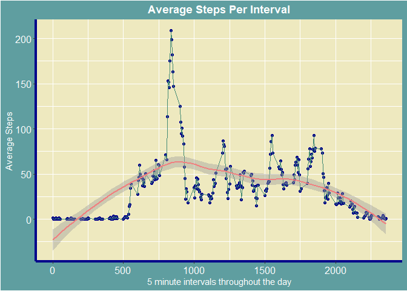
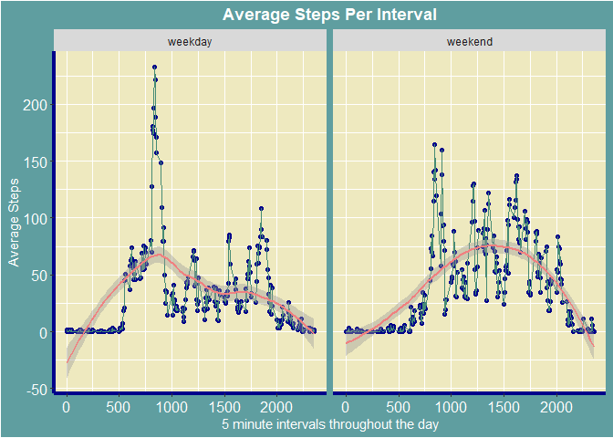

# Human movement Analysis using activity monitoring devices
### *By Varishu Pant*
### *30-06-2018*
### *Updated on 22-10-2019*

## Synopsis

It is now possible to collect a large amount of data about personal movement using activity monitoring devices such as a Fitbit, Nike Fuelband, or Jawbone Up. These type of devices are part of the “quantified self” movement - a group of enthusiasts who take measurements about themselves regularly to improve their health, to find patterns in their behavior, or because they are tech geeks. But these data remain under-utilized both because the raw data are hard to obtain and there is a lack of statistical methods and software for processing and interpreting the data.

This assignment makes use of data from a personal activity monitoring device. This device collects data at 5 minute intervals through out the day. The data consists of two months of data from an anonymous individual collected during the months of October and November, 2012 and include the number of steps taken in 5 minute intervals each day.

This Project attempts to answer the following questions-

1.What is the average daily activity pattern?  
2.Which 5-minute interval, on average across all the days in the dataset, contains the maximum number of steps?  
3.Are there differences in activity patterns between weekdays and weekends?


### Setting Working Directory


```r
setwd("C:/Users/Varishu Pant/Desktop/Praxis docs/R")
```

### Reading Data


```r
Data<-read.csv("activity.csv",header = TRUE)
```

## Exploring Data


```r
str(Data)
```

```
## 'data.frame':	17568 obs. of  3 variables:
##  $ steps   : int  NA NA NA NA NA NA NA NA NA NA ...
##  $ date    : Factor w/ 61 levels "2012-10-01","2012-10-02",..: 1 1 1 1 1 1 1 1 1 1 ...
##  $ interval: int  0 5 10 15 20 25 30 35 40 45 ...
```

```r
summary(Data)
```

```
##      steps                date          interval     
##  Min.   :  0.00   2012-10-01:  288   Min.   :   0.0  
##  1st Qu.:  0.00   2012-10-02:  288   1st Qu.: 588.8  
##  Median :  0.00   2012-10-03:  288   Median :1177.5  
##  Mean   : 37.38   2012-10-04:  288   Mean   :1177.5  
##  3rd Qu.: 12.00   2012-10-05:  288   3rd Qu.:1766.2  
##  Max.   :806.00   2012-10-06:  288   Max.   :2355.0  
##  NA's   :2304     (Other)   :15840
```

### Imputing Missing Values

Due to the sequential nature of the data,I use k nearest neighbours to impute missing values for steps variable.

```r
Data<-kNN(data = Data,variable = 'steps',k=5)
summary(Data)
```

```
##      steps                date          interval      steps_imp      
##  Min.   :  0.00   2012-10-01:  288   Min.   :   0.0   Mode :logical  
##  1st Qu.:  0.00   2012-10-02:  288   1st Qu.: 588.8   FALSE:15264    
##  Median :  0.00   2012-10-03:  288   Median :1177.5   TRUE :2304     
##  Mean   : 33.86   2012-10-04:  288   Mean   :1177.5                  
##  3rd Qu.:  9.00   2012-10-05:  288   3rd Qu.:1766.2                  
##  Max.   :806.00   2012-10-06:  288   Max.   :2355.0                  
##                   (Other)   :15840
```

#### Boxplot of interval Variable


```r
ggplot(data=Data,aes(y=interval))+geom_boxplot(fill='lightcoral',col='darkblue')+
labs(title='5 minute intervals')+
theme(plot.background = element_rect(fill='cadetblue'),panel.background=element_rect(fill='lemonchiffon2'))+
theme(plot.title = element_text(hjust = 0.5,face = 'bold',colour = 'white'),axis.text= element_text(size=12,colour='white'))+
theme(axis.line = element_line(colour = 'darkblue', size = 1.5, linetype = "solid"))+
theme(axis.title = element_text(colour = "white"))
```

<!-- -->

The data has activity for 61 days and for each of those days,data has been collected every 5 minute interval.
If variable says 835,it refers to activity during 8:35-8:40 am.Maximum is 2355 referring to activity during 23:55 and 00:00.Similarly minimum is 0 referring to activity during 00:00 and 00:05.


### Finding mean total number of steps taken per day

After I group the data by date,and summarise it to make a new dataset,I add appropriate column names to the new data set and plot a histogram of total steps taken per day.


```r
grouped_data<-group_by(Data,date)
newData<-summarise(grouped_data,sum(steps))
names(newData)<-c("Days","Steps_Taken")
ggplot(data = newData,aes(x=Steps_Taken))+geom_histogram(bins=9,fill='lightcoral',col='darkblue')+
labs(title='Total Steps Per Day',x="Total Steps Taken",y='Frequency')+
theme(plot.background = element_rect(fill='cadetblue'),panel.background=element_rect(fill='lemonchiffon2'))+
theme(plot.title = element_text(hjust = 0.5,face = 'bold',colour = 'white'),axis.text= element_text(size=12,colour='white'))+
theme(axis.line = element_line(colour = 'darkblue', size = 1.5, linetype = "solid"))+
theme(axis.title = element_text(colour = "white"))
```

<!-- -->

We see that on an average ,approximately 10000 steps are taken by per day.Now let's check if our estimation is correct by comparing it to the actual mean.


```r
Mean<-mean(newData$Steps_Taken)
Median<-median(newData$Steps_Taken)
paste("Mean of Total Number of Steps Taken Per Day is equal to" ,Mean)
```

```
## [1] "Mean of Total Number of Steps Taken Per Day is equal to 9752.39344262295"
```

```r
paste("Median of Total Number of Steps Taken Per Day is equal to",Median)
```

```
## [1] "Median of Total Number of Steps Taken Per Day is equal to 10395"
```

### Finding Average Daily Activity Pattern


I group Data by interval,and summarise it to make a new dataset.Then I make a time series plot of average number of steps taken per interval.


```r
grouped_data2<-group_by(Data,interval)
newData2<-summarise(grouped_data2,Average_Steps=mean(steps))
ggplot(data = newData2,aes(x=interval,y=Average_Steps))+geom_point(col='darkblue')+geom_line(col='aquamarine4')+geom_smooth(col='lightcoral',method = )+
labs(title='Average Steps Per Interval',x='5 minute intervals throughout the day',y='Average Steps')+
theme(plot.background = element_rect(fill='cadetblue'),panel.background=element_rect(fill='lemonchiffon2'))+
theme(plot.title = element_text(hjust = 0.5,face = 'bold',colour = 'white'),axis.text= element_text(size=12,colour='white'))+
theme(axis.line = element_line(colour = 'darkblue', size = 1.5, linetype = "solid"))+
theme(axis.title = element_text(colour = "white"))
```

```
## `geom_smooth()` using method = 'loess' and formula 'y ~ x'
```

<!-- -->

Observation-
Huge spike in activity around 8-10am[rush hours] probably due to office timings.
Throughout the day from 10am to 7pm average steps taken every minutes are around 50-100.
During the night from 11 pm to 6 am,average steps fall to approximately 0 per interval.

Now to find for which interval are the average steps maximum-


```r
max<-which.max(newData2$Average_Steps)
reqInterval<-newData2$interval[max]
paste("The interval number",reqInterval,"on average across all the days in the dataset, contains the maximum number of steps.")
```

```
## [1] "The interval number 835 on average across all the days in the dataset, contains the maximum number of steps."
```
In other words,on an average,highest activity spotted during 8:35-8:40am.


### Finding out if there are differences in activity patterns between weekdays and weekends

I create a new factor variable in the dataset with two levels - "weekday" and "weekend" indicating whether a given date is a weekday or weekend day


```r
Data$date<-as.Date(Data$date)
Data2<- mutate(Data, day = ifelse(weekdays(Data$date) == "Saturday" | weekdays(Data$date)=="Sunday","weekend","weekday"))

grouped_data3<-group_by(Data2,day,interval)
newData3<-summarise(grouped_data3,Average_Steps=mean(steps))
```


```r
ggplot(data = newData3,aes(x=interval,y=Average_Steps))+geom_point(col='darkblue')+geom_line(col='aquamarine4')+geom_smooth(col='lightcoral')+facet_grid(~factor(day))+
labs(title='Average Steps Per Interval',x='5 minute intervals throughout the day',y='Average Steps')+
theme(plot.background = element_rect(fill='cadetblue'),panel.background=element_rect(fill='lemonchiffon2'))+
theme(plot.title = element_text(hjust = 0.5,face = 'bold',colour = 'white'),axis.text= element_text(size=12,colour='white'))+
theme(axis.line = element_line(colour = 'darkblue', size = 1.5, linetype = "solid"))+
theme(axis.title = element_text(colour = "white"))
```

```
## `geom_smooth()` using method = 'loess' and formula 'y ~ x'
```

<!-- -->


In general,on weekends,average number of steps per interval throughout the day remain approximately in the inclusive range (75,125).Also any significant activity starts later in the day around 7:30-8am unlike weekdays where it started from 6am.There's more variance in activity during the weekdays than in the weekends with the highest average steps per interval taken on weekdays.
For weekdays,the trend line is right skewed showing large activity during first half of the day and low during the second half.For weekends,the trend line is left skewed showing more activity during second half of the day.
Also people tend to go sleep late during weekends.This can be seen by the drop in activity to 0 at 9pm during weekdays and on the other hand,at 11pm during weekends.


